<div align="center">


</div>

<div align="center">


</div>

<div align="center">

[](LICENSE)
[](https://python.org)
[](https://allpath-runner.dev)
[](senjutsu/skills/)
[](#compatible-avec-nimporte-quel-provider-ia)
[](examples/)
[](https://github.com/Tryboy869/dojutsu-for-ai/releases)

</div>

---

# 🥷 Dojutsu-for-AI

**Précision Absolue** — Un agent IA de code qui réfléchit avant de coder.

> *"Une tâche vague devient du code production-ready grâce à la vision structurelle, la cohérence systémique et l'anticipation de trajectoire."*

<div align="center">


</div>

---

## Comment ça marche

Dojutsu-for-AI exécute un **pipeline de 5 étapes** avant de générer du code :

| Étape | Technique | Ce qu'elle fait |
|-------|-----------|----------------|
| 1 | **Byakugan** 白眼 | Vision structurelle — voit ce qui est *vraiment* nécessaire vs ce qui est dit |
| 2 | **Mode Sage** | Cohérence systémique — détecte la dérive architecturale avant qu'elle arrive |
| 3 | **Jōgan** 淨眼 | Anticipation de trajectoire — repère les modes de défaillance cachés |
| 4 | **RAG Booster** | Sélectionne les skills les plus pertinents (scoring TF-IDF, 593+ skills) |
| 5 | **Exécution** | Génère du code complet et production-ready guidé par la triple analyse |

---

## Résultats du benchmark

<div align="center">



</div>

> **Dojutsu 90% vs Baseline 55%** — Le pipeline prend ~10× plus de temps mais anticipe
> 8 modes de défaillance production non mentionnés dans la tâche.
> Voir [`tests/benchmarks/`](tests/benchmarks/) pour l'analyse complète.

---

## Compatible avec n'importe quel provider IA

Dojutsu-for-AI fonctionne avec **tout provider LLM** — propriétaire ou open source :

| Provider | Modèles exemples | Variable d'env |
|----------|-----------------|----------------|
| **Groq** | `moonshotai/kimi-k2-instruct-0905`, `llama-3.3-70b` | `GROQ_API_KEY` |
| **OpenAI** | `gpt-4o`, `gpt-4o-mini`, `o3` | `OPENAI_API_KEY` |
| **Anthropic** | `claude-opus-4-5`, `claude-sonnet-4-5` | `ANTHROPIC_API_KEY` |
| **Mistral** | `mistral-large-latest`, `codestral-latest` | `MISTRAL_API_KEY` |
| **OpenRouter** | Tout modèle via API unifiée | `OPENROUTER_API_KEY` |
| **HuggingFace** | `mistralai/Mistral-7B`, `Qwen/Qwen2.5-Coder` | `HUGGINGFACE_API_KEY` |

---

## Démarrage rapide — Clone & Run

Aucun pip install. Aucun package manager. Juste cloner et utiliser.

```bash
# 1. Clone
git clone https://github.com/Tryboy869/dojutsu-for-ai
cd dojutsu-for-ai

# 2. Installer la seule dépendance runtime
pip install groq  # ou: pip install openai / anthropic / mistralai

# 3. Définir ta clé API
export GROQ_API_KEY=gsk_ta_clé_ici

# 4. Lancer
python providers/dojutsu-agent/main.py run "Construire un service d'auth FastAPI avec JWT"
```

---

## Allpath Runner (recommandé pour les projets multi-langages)

Dojutsu-for-AI est distribué comme provider **Allpath Runner** — appelable depuis n'importe quel langage.

```bash
# 1. Clone (si pas encore fait)
git clone https://github.com/Tryboy869/dojutsu-for-ai
cd dojutsu-for-ai

# 2. Démarrer le daemon
python allpath-runner.py daemon &
```

### Appel depuis Python

```python
import socket, json

def dojutsu(fn, args=[]):
    s = socket.socket(socket.AF_UNIX, socket.SOCK_STREAM)
    s.settimeout(120)
    s.connect('/tmp/allpath_runner.sock')
    s.sendall(json.dumps({"package": "dojutsu-agent", "function": fn, "args": args}).encode())
    chunks = []
    while chunk := s.recv(65536):
        chunks.append(chunk)
    s.close()
    return json.loads(b''.join(chunks))

# Pipeline complet — Groq / Kimi
result = dojutsu("run", ["Construire une queue async avec FastAPI", "gsk_xxx", "groq"])

# Avec OpenAI
result = dojutsu("run", ["Construire une queue async", "sk-xxx", "openai", "gpt-4o"])

print(result["execution"])    # code production-ready
print(result["skills_used"])  # skills sélectionnés par le RAG
```

---

## Exemples multilangage

Tous les langages se connectent au même daemon Allpath via socket Unix — **zéro configuration supplémentaire**.

> TypeScript · Go · Rust · Java · PHP · Ruby · C# — voir [`examples/`](https://github.com/Tryboy869/dojutsu-for-ai/tree/main/examples)

---

## Fonctions disponibles

| Fonction | Description | Temps |
|----------|-------------|-------|
| `run` | Pipeline complet 5 étapes → code complet | ~60-90s |
| `byakugan` | Analyse structurelle seule (1 appel LLM) | ~8-12s |
| `skills_list` | Liste les 593+ skills indexés | instant |
| `skills_count` | Nombre de skills indexés | instant |
| `check_skill` | Validation sécurité d'un skill | instant |
| `version` | Version + providers supportés | instant |

---

## Assets SVG animés

Le dossier `assets/` contient **5 SVG animés** conçus pour ce README :

| Fichier | Contenu | Utilisation |
|---------|---------|-------------|
| `header.svg` | Titre animé avec ligne de scan + particules | Haut du README |
| `logo-eyes.svg` | Yeux Byakugan × Jōgan clignotants | Identité / hero |
| `dev-card.svg` | Carte créateur avec bordure animée | Section auteur |
| `footer.svg` | Footer dégradé avec point de lumière | Bas du README |
| `benchmark.svg` | Comparaison cinématique Baseline vs Dojutsu | Section benchmark |

Toutes les animations respectent `prefers-reduced-motion`.

---

<div align="center">


</div>
