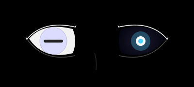
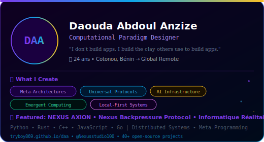
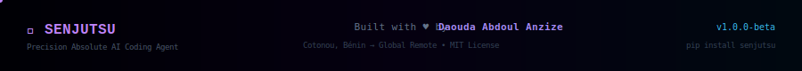

<p align="center">
  
</p>

<p align="center">
  
</p>

<p align="center">
  
  
  
  
  
</p>

<p align="center">
  
  
  
  
  
</p>

---

## 🌌 What is Senjutsu?

**Senjutsu** is an AI coding agent that thinks like an expert developer **before** writing a single line of code.

Instead of generating code immediately, it runs a **Precision Absolute pipeline** inspired by cognitive models from the Naruto universe:

| Module | Role |
|--------|------|
| 🔵 **Byakugan** | Reveals the *real* structure of a request — not what is said, but what IS |
| 🌍 **Mode Sage** | Evaluates global systemic coherence — a locally perfect decision can be globally catastrophic |
| 👁️ **Jōgan** | Detects emergent trajectories — rejects decisions correct now but dangerous later |
| 📚 **RAG Booster** | Retrieves relevant skills from 150+ sources (anthropics, microsoft, vercel, cursorrules...) |
| 🛡️ **Security** | Triple-layer validation — every skill is scanned before use |
| 💻 **Dev Expert** | Enforces full-stack architecture, security, SEO, and stack selection standards |

---

## ⚡ Quick Start

```bash
pip install senjutsu
```

```python
from senjutsu import SenjutsuAgent

agent = SenjutsuAgent(api_key="gsk_your_groq_key")
result = agent.run("Build a multi-tenant SaaS analytics dashboard")

print(result.byakugan)    # Structural analysis
print(result.mode_sage)   # Systemic coherence
print(result.jougan)      # Trajectory anticipation
print(result.execution)   # Production-ready code
```

---

## 🏗️ Architecture

```
Your Task (vague)
    ↓
🔵 BYAKUGAN     → Reveals real structure (not the words — the reality)
    ↓
🌍 MODE SAGE    → Evaluates systemic coherence + recommends stack
    ↓
👁️  JŌGAN       → Anticipates drifts, identifies points of no return
    ↓
📚 RAG BOOSTER  → Gravitational scoring across 150+ skills
    ↓
🛡️  SECURITY    → Pattern scan + LLM semantic review of selected skills
    ↓
💻 EXECUTION    → Production-ready deliverable guided by triple perception
```

### Skills Sources (RAG Booster)

| Source | Format | Skills |
|--------|--------|--------|
| `anthropics/skills` | SKILL.md | ~50 |
| `microsoft/skills`  | SKILL.md | 131 |
| `vercel-labs/skills`| SKILL.md | ~30 |
| `regenrek/agent-skills` | SKILL.md | ~15 |
| `awesome-cursorrules` | .cursorrules | 300+ |
| Built-in: dev-expert, github-actions, svg-animations | SKILL.md | 3 |

---

## 📦 Allpath Runner Compatible

Senjutsu follows the [Allpath Runner](https://github.com/Tryboy869/allpath-runner) specification:

```json
// allpath.expose.json
{
  "name": "senjutsu-coding-agent",
  "language": "python",
  "entry_point": "senjutsu/main.py",
  "functions": [
    {"name": "run", "description": "Full Precision Absolute pipeline"},
    {"name": "version"},
    {"name": "skills_list"}
  ]
}
```

```python
# From any language via Allpath
result = allpath.call("senjutsu-coding-agent", "run", [task, api_key])
```

---

## 🛡️ Security

Every skill goes through a **triple validation**:

1. **Fast pattern scan** — regex detection of prompt injection, exfiltration, credential theft
2. **LLM semantic review** — Byakugan-inspired analysis of skill intent
3. **Sanitization** — Remove malicious lines, keep useful content

```python
from senjutsu.core.security import is_skill_safe, sanitize_skill

safe, issues = is_skill_safe(skill_content)
clean = sanitize_skill(skill_content)
```

---

## 🔧 Advanced Usage

```python
from senjutsu import SenjutsuAgent, SkillsRAG

# Custom skills directory
rag = SkillsRAG(
    cache_dir=".my_cache",
    local_skills_dir="./my_skills"
)
rag.pull_repos()      # Clone anthropics, microsoft, vercel, regenrek
rag.index_all()       # Index all found skills with security validation

agent = SenjutsuAgent(
    api_key="gsk_...",
    provider="groq",           # or "openai"
    model="moonshotai/kimi-k2-instruct",
    rag=rag,
    verbose=True
)

result = agent.run("Your task here")
print(f"Skills used: {result.skills_used}")
print(f"Total time: {result.total_seconds:.1f}s")
```

### CLI

```bash
senjutsu "Build a FastAPI authentication service with JWT" --api-key gsk_...
senjutsu --skills    # List all indexed skills
senjutsu --version
```

---

## 👨🏾‍💻 About the Author

<p align="center">
  
</p>

**Daouda Abdoul Anzize** — Computational Paradigm Designer  
24 years old • Cotonou, Bénin → Global Remote  

*"I don't build apps. I build the clay others use to build apps."*

Creator of: **NEXUS AXION** • **NGPC** • **Allpath Runner** • **Nexus Backpressure Protocol**

🎯 Open to: Research labs, Protocol foundations, Fellowships, Remote roles  
📫 [anzize.contact@proton.me](mailto:anzize.contact@proton.me) • [@Nexusstudio100](https://twitter.com/Nexusstudio100) • [tryboy869.github.io/daa](https://tryboy869.github.io/daa)

---

<p align="center">
  
</p>

<p align="center">
  <sub>MIT License • Senjutsu Coding Agent v1.0.0-beta</sub>
</p>
